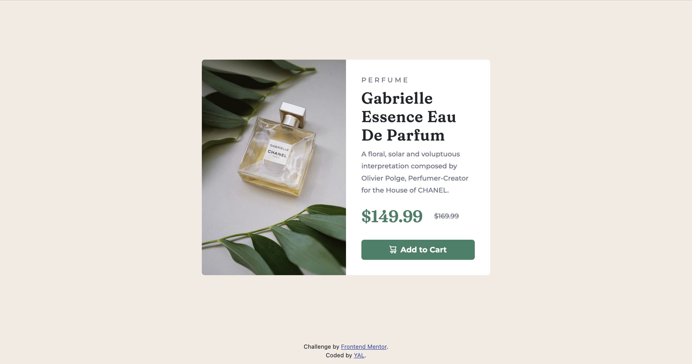
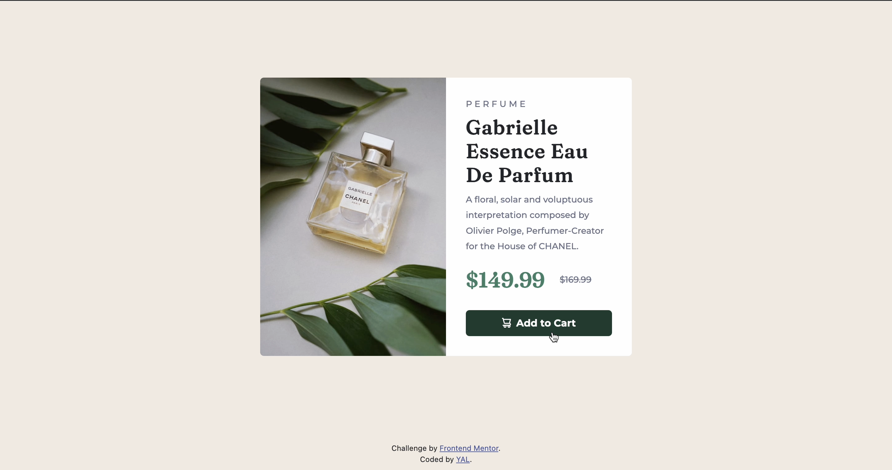
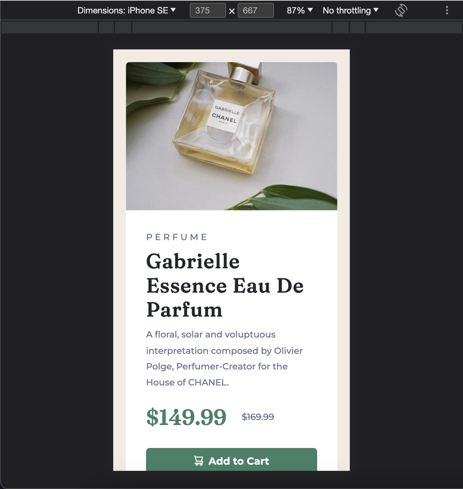

# Frontend Mentor - Product preview card component solution

This is a solution to the [Product preview card component challenge on Frontend Mentor](https://www.frontendmentor.io/challenges/product-preview-card-component-GO7UmttRfa). Frontend Mentor challenges help you improve your coding skills by building realistic projects. 

## Table of contents
- [Overview](#overview)
  - [The challenge](#the-challenge)
  - [Screenshot](#screenshot)
  - [Links](#links)
- [My process](#my-process)
  - [Built with](#built-with)
  - [What I learned](#what-i-learned)
  - [Continued development](#continued-development)
- [Author](#author)
- [Acknowledgments](#acknowledgments)

## Overview
### The challenge
Users should be able to:
- View the optimal layout depending on their device's screen size
- See hover and focus states for interactive elements

### Screenshot




### Links
- Live Site URL: https://yacodingroom.github.io/product-preview-card/

## My process
### Built with
- Semantic HTML5 markup
- CSS custom properties
- Bootstrap
- Flexbox

### What I learned
flexbox
前幾個挑戰都是慢慢調整，這次用了flexbox來垂直與水平置中，速度快很多。（感動落淚）

@media 與 content
從電腦版改成手機版時，用 max-width （小於最大寬的時候..），反之就是 min-width。
用中文很難說明（眼神死）。

```html
<main class="d-flex align-items-center product-page justify-content-center">
      <div class="card mb-3 bg-white" style="max-width: 600px;">
        ...
        ..
      </div>
  </main>
```
```css
@media screen and (max-width:767px) {
    .product-img {
        content: url(images/image-product-mobile.jpg);
        border-top-right-radius: 0.375rem;
        border-bottom-left-radius: 0!important;
    }
}
```

## Author
- Frontend Mentor - [@YAcodingroom]
(https://www.frontendmentor.io/profile/YAcodingroom)
- Threads - [@nt19_lya](https://www.threads.net/@nt19_lya)

## Acknowledgments
感謝Angela老師，感謝靜文老師，感謝Google，感謝Bootstrap，感謝小水豚工具書，感謝宇宙，感謝自己的願意練習。
感謝另一半給我空間與時間，還要忍受我在coding時的臭臉（抱歉抱歉）。
